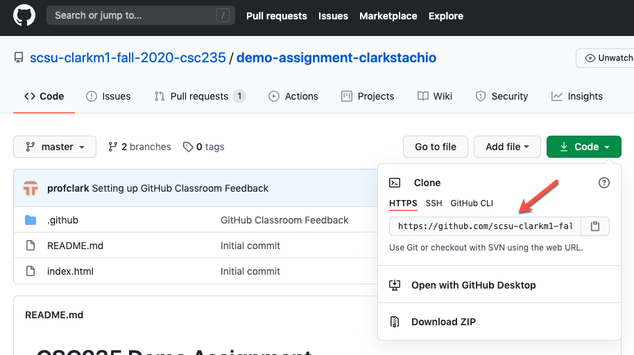
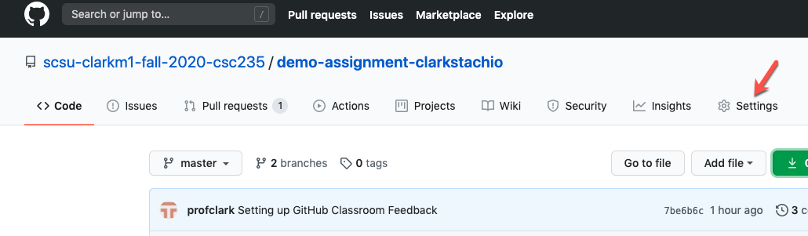
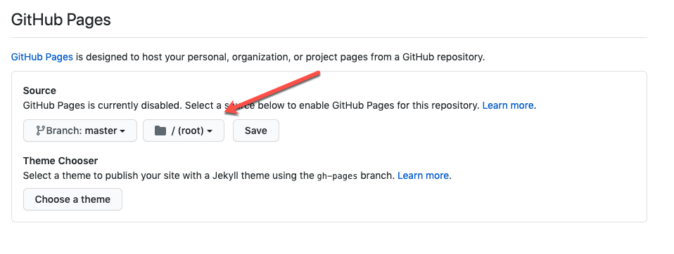
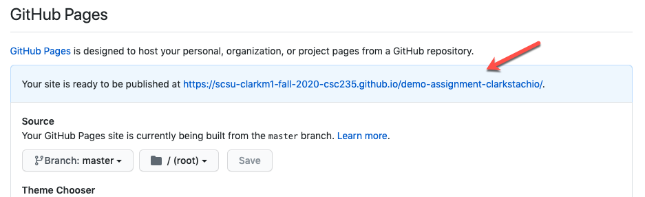

# Assignment - Git/GitHub & Basic HTML
In this assignment, you will practice the basic Git/GitHub workflow for this class while learning basic HTML.

## Objectives
* Clone a git repository
* Practice core Git commands
* Practice modifying basic HTML
* Publish a web page to GitHub Pages

## Prerequisites
* You have registered a GitHub account
* You have accepted the GitHub classroom assignment.

## Instructions
### Clone Repository
Note the address of your repository. Below is a screenshot from my repository. Your URL will differ and end in your github username.



Using this address, clone your repository to your local machine. A folder with the repository name will be created where you issued the command.
```bash
git clone https://{you repository url}
```
> Make sure to use your repository URL here.

### Change the Page Title
After cloning the repository, open up the newly created folder in VS Code. You should have an *index.html* file in the folder root. Open this file. Also, open the file up with *Live Server* to view locally in your browser

> You should have downloaded *Live Server* when installing your development tools.

Our first task is to change the title that appears in the browser window/tab. The title is specified within the head section of the document between the `<title>` tags. Let's change this to the topic of our page "Quarantine TV Favorites"

Make the change as shown below ...

```html
<head>
    <meta charset="UTF-8">
    <meta name="viewport" content="width=device-width, initial-scale=1.0">
    <title>Quarantine TV Favorites</title>
</head>
```
Save your changes in VS Code. Notice that *Live Server* updated the page in your browser.

After you have verified that your changes are correct, commit your changes.

```bash
git add .
git commit -m 'Updated page title'
```
Veryify that your commit has been accepted by viewing the commit history.

```bash
git log
```
### Update the Page Heading and Paragraph
Next find the level 1 heading within the body of the document and update to the following.

```html
<body>
    <h1>My TV Favorites During Quarantine</h1>
```

Save your changes and note the changes in your browser.

In addition, change the first paragraph to introduce the purpose of the page. You may put whatever you want here.

``` html
<h1>My TV Favorites During Quarantine</h1>
<p>Page introduction, etc. etc.</p>
```

Add two more paragraph tags with content after this with any content you wish. **Do not** nest the paragraphs inside of one another. Instead, put the two additional paragraphs after the first ...

```html
<h1>My TV Favorites During Quarantine</h1>
<p>Page introduction, etc. etc.</p>
<p>Another paragraph</p>
<p>Another parapraph</p>
```

Commit your changes (same process as before) and verify your commit exists in the git history.

### Specify your Favorite TV
In this last set of changes, we will specify a page sub-title and then list out your top 5 favorite movies/shows you watched during the 2020 quarantine.

First, add a level-2 heading below the paragraphs you added. A level-2 heading will display (by default) smaller than a level-1, but larger than a level-3. Add something like the following ...

``` html
<p>Page introduction, etc. etc.</p>
<p>Another paragraph</p>
<p>Another parapraph</p>
<h2>Top 5 Favorite 2020 Quarantine TV</h2>
```
Next, create an ordered list to specify your favorites. An ordered list will be numbered sequentially automatically.

``` html
<h2>Top 5 Favorite 2020 Quarantine TV</h2>
<ol>
    <li>Hannibal</li>
    <li>Another pick</li>
    <li>Another pick</li>
    <li>Another pick</li>
    <li>Another pick</li>
</ol>
```

Save, test, commit and verify your commit history.

### Push Changes to GitHub & GitHub Pages
After you have verified that you are finished with your assignment, push your changes to your remote GitHub repository.

``` bash
git push
```
Navigate to your GitHub repository in a browser and verify that your changes appear in your remote repository.

Finally, we will publish the site to GitHub Pages. Navigate to your repository settings in GitHub (my repository shown below, your URL will differ).



Scroll down to the GitHub Pages section and choose the master branch and root. Save your changes.



After your changes are saved, go back to the GitHub Pages settings. You will notice the URL of the page. Click it. Your page is published!



## Submitting your assignment
During our next lecture, we will discuss how to submit your assignment.


